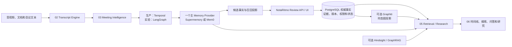

# 开源 AI Memory 项目调研与 NotaRitmo 落地选型

> 调研快照：2026-07-31。Star 数量是 GitHub 页面当日近似值，会持续变化；Star 只反映社区关注度，
> 不代表时态正确性、数据治理能力或与 NotaRitmo 的适配程度。

## 结论

开源生态已经能够复用大部分通用能力，NotaRitmo 不应从零开发完整的摄取、Embedding、向量检索、
用户画像、Agent 记忆、图遍历和通用管理界面。

但现有项目普遍不能直接替代 NotaRitmo 第四模块的全部职责。会议记忆还需要处理：

- 人工审核后的正式决策、行动项、风险和开放问题。
- 原文、说话人、时间点与媒体证据。
- 当前状态、历史状态、迟到会议和乱序导入。
- `supports`、`supersedes`、`contradicts`、`amends` 等业务关系。
- 项目、租户、来源权限、删除传播和审计。
- 自动抽取结果与组织正式事实之间的晋升边界。

因此采用：

> 一个主 Memory Provider 加一个薄的 NotaRitmo Control Plane；  
> Memory Provider 负责通用能力，PostgreSQL Control Plane 负责审核、证据、版本、权限和当前有效状态。

第一版不要同时接入 Mem0、Supermemory、Graphiti、Hindsight 和 Cognee。先用统一适配接口测试候选，
每一类能力只保留一个默认实现。

## 项目清单

| 项目 | 约 Star | License | 定位与主要能力 | NotaRitmo 适用位置 | 结论 |
|---|---:|---|---|---|---|
| [Mem0](https://github.com/mem0ai/mem0) | 62.2k | Apache-2.0 | 用户、Session、Agent 多级记忆；事实抽取、更新、过滤、语义/关键词/实体召回；自托管服务与界面 | 03 候选抽取，04 Shadow Memory，05 召回 | 成熟通用候选；不能直接决定正式会议状态 |
| [Agno](https://github.com/agno-agi/agno) | 41.5k | Apache-2.0 | Agent SDK、AgentOS Runtime/UI、PostgreSQL、Memory、Knowledge、审批、RBAC、审计和集成 | 06 Agent 产品壳与平台运行时 | 适合快速做完整 Agent 产品，不是专用会议事实引擎 |
| [LangGraph](https://github.com/langchain-ai/langgraph) | 38.5k | MIT | 持久化状态图、长任务、恢复、工具调用、人工中断和记忆接口 | 抽取、审核、写入实验编排；05 Research Planner | 是编排框架，不是 Memory 数据库 |
| [Microsoft GraphRAG](https://github.com/microsoft/graphrag) | 35.1k | MIT | 实体关系抽取、社区摘要、局部/全局图检索 | 05 跨会议主题研究与全集总结 | 适合离线研究，不适合作为增量当前状态主库 |
| [Cognee](https://github.com/topoteretes/cognee) | 29.6k | Apache-2.0 | 图与向量、Ontology、多模态、可组合摄取流水线、隔离、API、UI、MCP | 03/05/06 企业知识大脑原型 | 功能覆盖广，是一体化候选 |
| [Graphiti](https://github.com/getzep/graphiti) | 29.4k | Apache-2.0 | Temporal Knowledge Graph、Episode 来源、事实有效期、实体关系、历史查询、Hybrid Search | 04 时态关系候选和图投影 | 与第四模块语义最匹配，但需要自建审核和产品层 |
| [Supermemory](https://github.com/supermemoryai/supermemory) | 28.7k | MIT | 文档、图片、视频和代码摄取；连接器；事实更新、用户画像、遗忘、RAG、Dashboard、App、MCP | 01 轻量摄取，03/05 通用能力，06 快速产品壳 | 最快形成可演示产品；正式决策不能使用自动遗忘规则 |
| [Letta](https://github.com/letta-ai/letta) | 24.0k | Apache-2.0 | Stateful Agent、Memory Blocks、Archival Memory、工具、Skills、Subagents | 长期运行的会议助理 Agent | 更偏 Agent Runtime；当前仓库包含 legacy server，需关注迁移方向 |
| [Hindsight](https://github.com/vectorize-io/hindsight) | 18.9k | MIT | Retain、Recall、Reflect；事实、经历、Mental Model；语义、BM25、图、时态并行召回 | 05 跨会议问答、原因分析和反思基线 | 很强的研究/召回基线，不应成为正式状态权威 |
| [memU](https://github.com/NevaMind-AI/memU) | 14.2k | Apache-2.0 | 本地个人记忆 Wiki、Markdown 技能沉淀、渐进检索、跨 Agent/设备适配 | 本地优先和个人工作区实验 | 轻量易读，不适合作为多租户会议 SaaS 主体 |
| [EverOS](https://github.com/EverMind-AI/EverOS) | 11.7k | Apache-2.0 | Markdown 原生真源、Git 可追踪、SQLite/LanceDB、Episode/Profile/Skill、反思巩固 | 用户可编辑会议知识和本地审计实验 | 可读、可 diff，生产多租户能力需补齐 |
| [MemOS](https://github.com/MemTensor/MemOS) | 10.5k | Apache-2.0 | 统一记忆 API、文本/图片/工具轨迹、Memory Cube、图和向量、调度、隔离与共享 | 04/05 综合 Memory Provider 候选 | 能力全面，但 Neo4j、Qdrant 等基础设施较重 |
| [Memobase](https://github.com/memodb-io/memobase) | 2.8k | Apache-2.0 | 时间事件、用户 Profile、FastAPI、PostgreSQL、Redis、多语言 SDK、Inspector | 参会者、客户和用户偏好画像 | 画像能力突出，不处理项目决策当前真相 |
| [LangMem](https://github.com/langchain-ai/langmem) | 1.6k | MIT | 热路径 Memory Tools、后台抽取/合并、LangGraph Store 集成 | 03 抽取与后台 Consolidation | 适合作为库嵌入，不是完整服务或产品 |
| [MemoryOS](https://github.com/BAI-LAB/MemoryOS) | 1.5k | Apache-2.0 | 短期、中期、长期分层个性化记忆，MCP、ChromaDB、Playground | 研究算法和评测参考 | 研究价值大于现阶段生产底座价值 |

Inflection Pi 是闭源产品，不是可直接 Fork 的 Memory 服务。一些名称包含 `pi-memory` 的仓库通常是
编码 Agent 插件，也不应与 Mem0、Supermemory、Graphiti 放在同一层比较。

## 能力分类

### 通用 Memory Service

候选：Mem0、Supermemory、MemOS、Memobase。

#### Mem0 的提取不是硬规则引擎

Mem0 的典型 `infer=true` 流程是由 LLM 从输入消息中提取候选 Memory，再交给 Embedding、向量
存储和检索组件；`infer=false` 只保存调用方已经准备好的内容。自定义 Prompt 或
`custom_instructions` 只能构成软约束，不能保证字段完整、证据存在、时间正确或“建议”和
“正式决定”永不混淆。

在 NotaRitmo 中，Mem0 的 LLM 提取结果必须被视为 `CandidateClaim`：先经过 Schema 校验、
证据坐标校验、租户/权限校验、幂等检查和 Promotion Policy，再由 Go Memory Service 写入
PostgreSQL 的 Observation、Claim 和 StateVersion。只有 PostgreSQL 的审核状态和当前状态视图
可以对外作为正式会议事实。

因此 Mem0 适合复用通用的 Memory Formation、Embedding、Recall 和 CRUD，但不应替代会议专用的
证据合同、Decision/Action/Risk/Question 状态机、双时态版本和数据库硬约束。原始转写、模型
版本、Prompt 版本和候选输出必须保留，以便用更强 LLM 重跑并比较，不得静默覆盖权威事实。

它们适合复用：

- 内容摄取和标准化。
- 事实、偏好和画像抽取。
- Memory CRUD、过滤和命名空间。
- Embedding、向量索引和通用召回。
- 后台巩固、去重、更新和遗忘候选。
- SDK、API、Dashboard 或应用界面。

它们通常缺少：

- 决策、行动、风险和问题的独立业务状态机。
- 业务有效时间与系统记录时间分离。
- 精确的会议原文、说话人、音频时间点证据合同。
- 人工批准后不可被模型静默覆盖的正式状态。

### Temporal Graph

候选：Graphiti。

Graphiti 的映射关系最直接：

| Graphiti | NotaRitmo |
|---|---|
| Episode | 会议或 Artifact 来源 Observation |
| Entity Node | Person、Project、Product 等 Entity |
| Fact / Edge | Claim 与候选 Relation |
| Validity Window | StateVersion 的业务有效时间候选 |
| Episode Provenance | Evidence 来源 |
| Hybrid Search | 05 图与文本候选召回 |

Graphiti 可以显著减少时态图、关系发现和历史查询的自研工作，但它仍然是投影与候选层。正式
`StateSlot`、审核状态、ACL、删除和并发不变量保留在 NotaRitmo。

### Retrieval / Reflection

候选：Hindsight、Cognee、GraphRAG。

- Hindsight 适合回答“过去发生过什么”“为什么后来改变”，以及对长期经历进行 Reflect。
- Cognee 适合快速建立图与向量结合的企业知识库。
- GraphRAG 适合离线构建全局主题、社区摘要和跨大量会议的研究视图。

三者产生的总结、Mental Model 和推断都属于 `Derived Insight`，不能自动晋升为第四模块正式事实。

### Agent Orchestration / Runtime

候选：LangGraph、Agno、Letta。

- LangGraph 适合明确的多阶段状态工作流和人工中断。
- Agno 适合快速获得 Agent API、UI、RBAC、存储、审计和外部渠道。
- Letta 适合长期运行并主动使用记忆的个人或团队助理。

它们不能替代 Memory 数据合同；Agent 的内部状态也不能自动变成会议事实。

## 与六个模块的组合

| NotaRitmo 模块 | 可复用项目 | 保留的 NotaRitmo 能力 |
|---|---|---|
| 01 Media Intake | Supermemory 的连接器和多模态摄取可作快速原型 | 安全下载、文件状态、对象存储、重试和媒体质量 |
| 02 Transcript Engine | 本调研项目均不能完整替代专业 ASR 与 Diarization | 转写、说话人、对齐、时间戳和版本 |
| 03 Meeting Intelligence | Mem0、Supermemory、Cognee、LangMem | Decision、Action、Risk、Question Schema 与证据校验 |
| 04 Meeting Memory | Graphiti、Mem0、MemOS | Promotion、审核、双时态、当前状态、ACL、删除与审计 |
| 05 Retrieval / Research | Hindsight、Cognee、GraphRAG、Supermemory | 授权快照、覆盖、拒答、引用与当前状态权威读取 |
| 06 Product Interaction | Supermemory App、Cognee UI、Agno UI | NotaRitmo 项目时间线、审核台、权限和稳定产品 API |
| Workflow | Temporal 为生产基线；LangGraph/Agno 作候选 | 任务权威状态、幂等、预算、补偿和恢复 |

## 三条可落地路线

### A. 最快上线：Supermemory + 薄 Control Plane

目标：先在两到四周内形成可演示、可试用的产品。

复用 Supermemory：

- 文件和连接器摄取。
- 文本、图片和视频内容处理。
- 用户画像、事实更新、语义搜索和 RAG。
- 现有 App、Dashboard、MCP 和连接器入口。

NotaRitmo 只新增：

```text
Project
Meeting
Evidence
CandidateFact
CanonicalFact
FactRevision
ReviewAction
```

约束：

- 使用 `tenant_id + project_id` 映射 Supermemory 的容器或命名空间。
- Supermemory 中的自动更新、矛盾和遗忘只是候选。
- `human_approved` 的 Decision/Action/Risk/Question 写入 PostgreSQL。
- 回答“当前正式决定”必须读取 CanonicalFact，不直接使用通用 RAG 结果。

这是最快的产品验证路线，也是默认推荐的第一轮实现。

### B. 稳妥通用：Mem0 + NotaRitmo API

目标：保持 Python/SDK 生态兼容，并逐步替换 Provider。

- 自托管 Mem0 Server，复用 Memory CRUD、提取、过滤和召回。
- Go Memory Adapter 注入 `tenant_id`、`project_id`、`meeting_id`、`artifact_id` 和证据引用。
- Mem0 返回候选事实；NotaRitmo Review API 决定是否晋升。
- 使用现有 PostgreSQL 保存正式事实、版本和审核。
- 第五模块可直接对比 Mem0 Search 与自建 PostgreSQL FTS/pgvector。

这一方案的产品壳不如 Supermemory 完整，但边界清晰、可替换性好。

### C. 核心差异化：Graphiti Temporal Projection

目标：把“当前决定、历史决定、何时变化、为什么变化”做成核心卖点。

- 每个最终会议或 Artifact 版本写成 Episode。
- 自定义 Person、Project、Decision、Action、Risk 和 Question 类型。
- 将 Graphiti 关系与有效期返回为候选。
- 经过 Evidence、Scope、来源权威和人工审核后写入正式 StateVersion。
- Graphiti 用于关系遍历与历史候选；PostgreSQL 用于正式时间线。

这条路线产品价值最高，但不适合作为第一周的完整产品底座。先完成 A 或 B 的闭环，再增量接入。

## 推荐架构



## 统一 Provider 接口

不要让业务代码直接依赖某个开源项目的私有对象。第一版至少固定以下适配语义：

```text
Retain(project, meeting, content, metadata) -> provider_memory_ids
Recall(scope, query, filters, as_of_time) -> candidate_hits
Get(memory_id) -> provider_memory
Update(memory_id, content, metadata) -> provider_version
Forget(source_or_subject) -> deletion_receipt
Health() -> capabilities_and_versions
```

NotaRitmo 自有写入接口保持独立：

```text
PromoteCandidate
ApproveCandidate
RejectCandidate
SupersedeFact
CorrectFact
DeleteEvidence
GetCurrentState
GetStateTimeline
```

这样可以在不改变产品 API 的情况下替换 Supermemory、Mem0 或其他候选。

## 快速实施顺序

### 第 1 周：跑通功能闭环

1. 部署 Supermemory 和 Mem0，使用同一批中文会议文本做 Smoke Test。
2. 只保留一个主 Provider；另一个退出在线路径。
3. 实现 Project、Meeting、Evidence、CandidateFact、CanonicalFact 和 ReviewAction。
4. 跑通“导入会议 → 自动抽取 → 人工审核 → 项目搜索”。

### 第 2 周：形成可试用产品

1. 增加 Decision、Action、Risk、Question 四种类型。
2. 增加当前项目快照、会议证据链接和修改历史。
3. 增加租户与项目隔离、删除传播和失败重试。
4. 输出一个真实可用的 Web 审核台和项目问答入口。

### 第 3 至 4 周：验证核心差异

1. 选择 Graphiti 作为 Shadow Temporal Projection。
2. 对比规则、Embedding 和 Graphiti 的替代/冲突关系准确率。
3. 对高价值跨会议问题测试 Hindsight；不急于进入正式链路。
4. 只有 MeetingMemoryBench 证明净增益后，才把候选提升为默认 Provider。

## 候选验收

不能只根据 Star、README Demo 或项目自带 Benchmark 决定。Supermemory、Mem0、Graphiti 至少使用
同一组 MeetingMemoryBench 场景：

1. Flutter 只是建议，不能成为已接受决策。
2. Kotlin 后来被正式接受，并替代同 Scope 的 Flutter。
3. 旧会议迟到导入，只修正历史，不覆盖今天。
4. 同一会议重复上传不产生重复事实。
5. 删除一条证据但仍有其他证据时，Claim 继续有效。
6. 删除最后一条证据后，所有检索投影均不可返回内容。
7. Action 从 `OPEN -> DONE -> REOPENED` 保留完整历史。
8. 不同项目、租户和权限之间无数据泄漏。

统一记录：

| 维度 | 指标 |
|---|---|
| 正式事实 | Candidate Precision、Review Acceptance Rate |
| 当前状态 | Current State Exact Match |
| 历史变化 | Temporal Snapshot Accuracy |
| 证据 | Evidence Coverage、可播放率 |
| 删除 | Delete Closure、Projection Residue |
| 权限 | Cross-tenant Leak Count |
| 检索 | Recall、MRR、nDCG、False Answer Rate |
| 工程 | 部署时间、修改代码量、P95、成本、升级兼容性 |

## 最终选择

当前建议：

```text
快速上线默认：
  Supermemory + NotaRitmo PostgreSQL Control Plane

更稳妥的通用备选：
  Mem0 + NotaRitmo API / Review

第四模块差异化增强：
  Graphiti Temporal Projection

第五模块后期研究增强：
  Hindsight 或 GraphRAG

编排：
  生产权威流程继续使用 Temporal
  LangGraph 仅用于快速实验和开放式 Research Planner
```

最重要的取舍不是“选择哪个 Memory 项目永久绑定”，而是先复用成熟能力快速交付，同时把
审核、证据、当前有效状态和权限做成稳定的小型控制面。这样既避免完整自研一套庞大 Memory
平台，也避免把产品命运绑定在任何一个快速变化的开源项目上。
