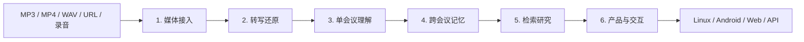

# NotaRitmo Luna

作者：`tianking`

NotaRitmo Luna 是一个从零开始的会议智能架构研究项目。当前分支不包含任何业务代码、
旧系统实现、部署配置或特定产品耦合，只定义六个可以独立研究、独立实现、独立评测和
独立替换的核心模块。

项目最终目标是：

> 输入音频、视频或标准转写，获得可信的逐字稿、单会议分析、跨会议记忆、检索研究、
> 证据回溯和产品交互能力。

## 六个模块

| 顺序 | 模块 | 唯一核心职责 | 输入 | 输出 |
|---|---|---|---|---|
| 1 | [媒体接入 Media Intake](01-media-intake/README.md) | 把外部输入变成可处理媒体资产 | 文件、URL、录音 | `MediaAsset` |
| 2 | [转写还原 Transcript Engine](02-transcript-engine/README.md) | 还原谁在什么时候说了什么 | `MediaAsset` | `TranscriptBundle` |
| 3 | [单会议理解 Meeting Intelligence](03-meeting-intelligence/README.md) | 分析一场会议的完整内容 | `TranscriptBundle` | `MeetingArtifactBundle` |
| 4 | [跨会议记忆 Meeting Memory](04-meeting-memory/README.md) | 保存事实并维护跨会议演化 | Artifact、证据、元数据 | `MemoryChangeSet` |
| 5 | [检索研究 Retrieval / Research](05-retrieval-research/README.md) | 找到证据并回答单会或跨会问题 | 查询、权限、范围 | `QueryResult` |
| 6 | [产品与交互 Product Interaction](06-product-interaction/README.md) | 为 Linux、Android、Web 提供稳定产品能力 | 用户请求 | 产品 API 与交互状态 |

## 总体流程



六块是业务能力边界，不代表必须立即部署六个微服务。研究阶段可以放在一个仓库中，
但模块之间只能通过标准合同交换数据，不能读取彼此的内部表、Provider 原始结果或私有
状态。

## 五个模块间数据合同

```text
MediaAsset
  -> TranscriptBundle
  -> MeetingArtifactBundle
  -> MemoryChangeSet
  -> QueryResult
```

所有合同都必须携带：

```text
tenant_id
meeting_id
schema_version
source_hash
producer
producer_version
created_at
evidence_refs
```

公共证据引用：

```json
{
  "meeting_id": "meeting_x",
  "segment_id": "seg_018",
  "speaker_id": "speaker_02",
  "start_ms": 183200,
  "end_ms": 195800,
  "quote": "首版我们改成原生 Kotlin。"
}
```

## 架构原则

1. **上游可替换**：云 ASR、本地 ASR、不同 LLM、不同向量库都只是 Provider。
2. **证据优先**：摘要、决策、Memory 和答案必须能回到原始转写与音频时间点。
3. **事实与索引分离**：结构化事实是权威数据；向量库和图数据库是可重建投影。
4. **Memory 与 RAG 分离**：Memory 决定记住什么和当前什么有效；RAG 负责查找和回答。
5. **单会与跨会分离**：一场会议的理解结果不能直接冒充跨会议长期状态。
6. **模型不直接写事实**：模型只产生候选，程序校验后才能形成正式数据。
7. **所有结果可版本化**：记录输入哈希、模型、Prompt、Schema、算法和索引版本。
8. **权限贯穿全链路**：租户、用户、项目和会议范围不能只在 API 入口检查。
9. **失败可定位**：媒体、转写、理解、记忆、检索和交互错误必须独立呈现。
10. **每块单独验收**：上游未完成时，下游可以使用标准 Fixture 独立开发。

## Provider 与基础设施不是业务模块

下面都是可替换实现，不增加第七个业务模块：

```text
ASR Provider
LLM Provider
Embedding Provider
Reranker Provider
Object Storage
PostgreSQL
Vector Store
Graph Store
Workflow Engine
Model Gateway
Observability
```

例如：

- Tingwu、本地 Qwen ASR 和其他云 ASR 属于转写模块内部实现。
- Qwen、OpenAI、Claude 和本地模型属于单会议理解或检索模块内部实现。
- PostgreSQL可以保存权威事实。
- pgvector、其他向量库、Neo4j、Graphiti可以作为可重建索引或关系投影。
- Mem0、Hindsight可以作为记忆实验实现，但不能绕过统一 Claim 合同。
- Temporal或其他任务系统只负责执行、重试和恢复，不拥有会议事实。

## 目录

```text
NotaRitmo/
├── README.md
├── 01-media-intake/
│   └── README.md
├── 02-transcript-engine/
│   └── README.md
├── 03-meeting-intelligence/
│   └── README.md
├── 04-meeting-memory/
│   └── README.md
├── 05-retrieval-research/
│   └── README.md
└── 06-product-interaction/
    └── README.md
```

当前阶段只有以上七份文档，不包含代码。

## 每个模块如何做到最好

每个模块都按照同一研究闭环推进：

```text
明确边界
  -> 固定输入输出 Schema
  -> 收集真实数据和失败样本
  -> 建立基线
  -> 对比开源、商业和自研方案
  -> 实现 Provider 接口
  -> 运行独立评测
  -> 选择默认方案
  -> 保留可替换实现
  -> 再进入下一模块
```

每块完成的标准不是“接口能调用”，而是同时具备：

- 标准输入输出。
- 黄金测试集。
- 质量指标和基线。
- 错误分类。
- 成本、速度和资源记录。
- 权限与删除测试。
- Provider 对比报告。
- 可重复运行的验收。

## 推荐研究顺序

1. 媒体接入：先保证任何输入都成为稳定媒体资产。
2. 转写还原：重点解决字准率、说话人、时间戳和身份确认。
3. 单会议理解：建立带证据的摘要、决策、待办和风险。
4. 跨会议记忆：建立 Claim、实体归并和时态状态机。
5. 检索研究：优化召回、排序、拒答、跨会综合和引用。
6. 产品与交互：最后固化客户端 API、修订、反馈和导出。

开发某一块时，只依赖上一块的标准 Fixture，不要求上一块的真实 Provider 已经部署。

## 项目完成后的用户能力

- 上传或导入音频、视频和录音。
- 查看逐字稿、说话人、词级时间和置信度。
- 查看摘要、章节、主题、决策、待办、风险和开放问题。
- 查看热词、词云、思维导图、时间线和人员观点。
- 搜索并定位任意一场会议。
- 对单场会议提问。
- 对多场会议做比较、汇总和趋势分析。
- 查询某项决策的历史变化和当前有效版本。
- 每条结论跳转并播放原音频证据。
- 在资料没有答案时得到明确拒答。
- 在 Linux、Android、Web 或外部 API 中使用同一套稳定能力。

## 当前阶段

`luna` 目前是纯架构研究起点：

- 没有业务代码。
- 没有数据库。
- 没有容器。
- 没有绑定任何云服务。
- 没有绑定任何 App。
- 只有六个模块的完整研究范围和验收方向。

后续每次只选择一个模块进入实现，并保持其他模块仍可通过标准合同替换。
