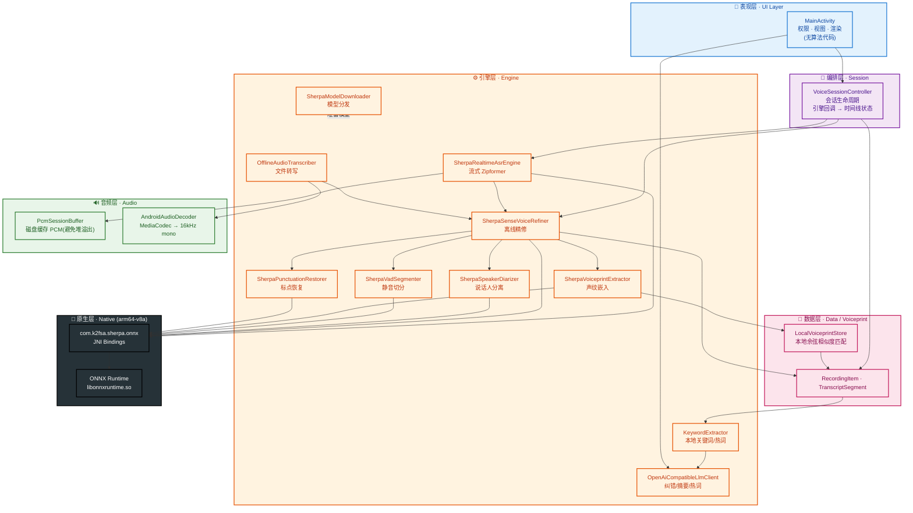
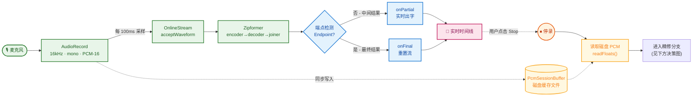
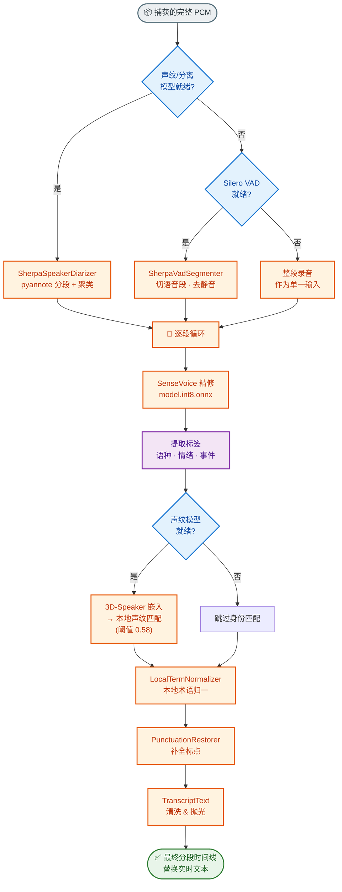
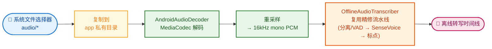
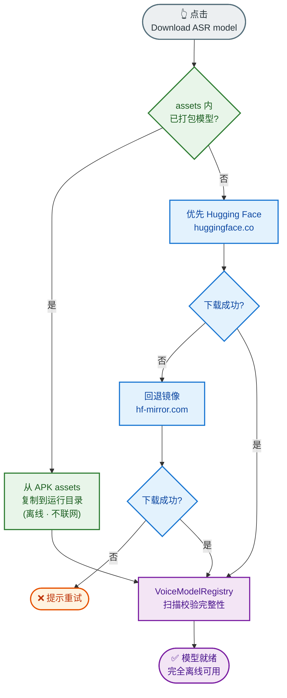
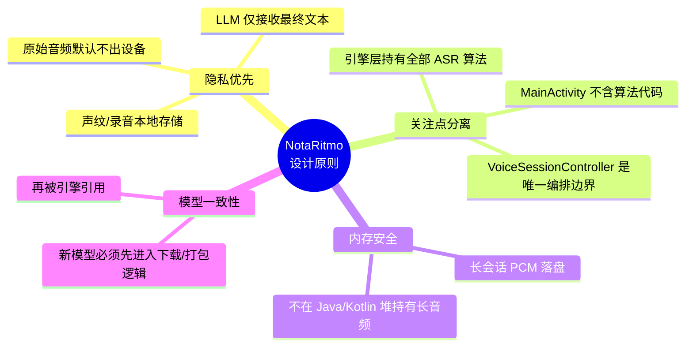

<div align="center">

# 🎙️ NotaRitmo

### 本地优先的 Android 语音实验室 · On-Device Voice Pipeline

*A local-first meeting & dictation voice lab — audio never leaves the device for ASR.*


<br>


<br>


<br>


</div>

---

## 📖 项目简介

**NotaRitmo** 是一个 **本地优先 (local-first)** 的 Android 语音处理应用，专为**会议记录、听写与转写**设计。
它通过 **sherpa-onnx + ONNX Runtime** 在设备端完成**全部语音识别链路**——从麦克风采集、实时流式 ASR、到停录后的精细化转写、说话人分离、标点恢复与声纹匹配。

> 🔒 **核心理念：原始音频默认不出设备。** 只有最终转写文本（可选）才会发送给外部 LLM 做摘要/纠错，音频本身永不外传。

### ✨ 核心能力

| 能力 | 说明 |
|------|------|
| 🎤 **实时流式 ASR** | 麦克风采集 16kHz 单声道 PCM，本地 Zipformer 实时出字，边说边显示 |
| 🧠 **双层转写** | 实时 Zipformer 保证低延迟；停录后 SenseVoice 对完整音频重新解码，提升最终准确率 |
| 🗣️ **说话人分离** | 本地 pyannote 分段 + 3D-Speaker 声纹嵌入，多人会议自动区分说话人 |
| 😊 **情绪 / 事件 / 语种标签** | SenseVoice 为每段输出语种、情绪与音频事件标签 |
| ✍️ **标点恢复** | 离线 CT-Transformer 模型补全逗号、句号等标点 |
| 🔉 **静音切除 (VAD)** | Silero VAD 在精修前切分语音段、剔除静音 |
| 🧬 **声纹注册与匹配** | 本地余弦相似度匹配已注册说话人，身份对齐 |
| 📂 **音频导入转写** | 通过系统选择器导入文件，本地 `MediaCodec` 解码后走同一套精修流水线 |
| 🗂️ **本地音频库** | 自动扫描录音与导入音频，支持再次转写、单条删除与一键清空 |
| 🏷️ **关键词 / 热词** | 本地领域词抽取 + 纠错高亮词 + LLM 总结热词分层展示 |
| ☁️ **可选 LLM 摘要/纠错** | 对接 OpenAI-compatible 或 Anthropic-compatible 文本端点，仅传入最终文本；先纠错，再总结与提取热词 |

---

## 🧰 技术栈 · Tech Stack

<div align="center">

<table>
<tr>
<td align="center" width="50%">

**🏗️ 平台 & 语言**


</td>
<td align="center" width="50%">

**🧠 端侧 AI / 语音**


</td>
</tr>
<tr>
<td align="center" width="50%">

**🎨 UI & AndroidX**


</td>
<td align="center" width="50%">

**🛠️ 构建 / 测试 / 模型分发**


</td>
</tr>
</table>

</div>

> 💡 UI 采用**纯代码编程式构建**（`MaterialCardView` + `LinearLayout`），无 XML 布局，保证运行时灵活渲染时间线卡片。

---

## 🏛️ 系统架构

### 分层架构总览



### 🔄 实时 ASR 运行流水线



### 🧭 精修阶段 · 分段决策与回退

> 停录后，应用按"模型可用性"自动选择最强可用路径，逐级回退。



### 📂 导入文件转写流水线



### 📥 模型分发与回退策略



---

## 📁 项目结构 · Project Structure

```
NotaRitmo/
├── app/
│   └── src/main/
│       ├── AndroidManifest.xml          # RECORD_AUDIO + INTERNET 权限
│       ├── java/com/example/notaritmo/
│       │   ├── MainActivity.java        # 📱 表现层:纯代码构建 Material UI
│       │   │
│       │   ├── session/                 # 🎯 编排层(会话边界)
│       │   │   ├── VoiceSessionController.java
│       │   │   └── VoiceSessionListener.java
│       │   │
│       │   ├── engine/                  # ⚙️ 引擎层(全部本地算法)
│       │   │   ├── SherpaRealtimeAsrEngine.kt      # 流式 Zipformer 实时识别
│       │   │   ├── SherpaSenseVoiceRefiner.kt      # SenseVoice 离线精修
│       │   │   ├── SherpaSpeakerDiarizer.kt        # 说话人分离
│       │   │   ├── SherpaVadSegmenter.kt           # Silero VAD 切分
│       │   │   ├── SherpaVoiceprintExtractor.kt    # 声纹嵌入
│       │   │   ├── SherpaPunctuationRestorer.kt    # 标点恢复
│       │   │   ├── OfflineAudioTranscriber.kt      # 文件转写(复用流水线)
│       │   │   ├── SherpaModelDownloader.java      # 模型分发
│       │   │   ├── SherpaPackagedModelInstaller.kt # APK 内置模型安装
│       │   │   ├── OpenAiCompatibleLlmClient.java  # 可选 OpenAI/Anthropic 文本 LLM
│       │   │   ├── KeywordExtractor.kt             # 本地关键词/热词抽取
│       │   │   ├── LocalTermNormalizer.kt          # 本地术语归一
│       │   │   ├── TranscriptText.kt               # 文本清洗
│       │   │   └── SenseVoiceTags.kt               # 标签映射
│       │   │
│       │   ├── ui/                      # 🎛️ 自定义轻量 UI 控件
│       │   │   └── KeywordFlowLayout.java          # 关键词自动换行布局
│       │   │
│       │   ├── audio/                   # 🔊 音频层
│       │   │   ├── PcmSessionBuffer.kt             # 磁盘缓存 PCM(长会话)
│       │   │   └── AndroidAudioDecoder.kt          # MediaCodec 解码
│       │   │
│       │   ├── data/                    # 💾 领域数据
│       │   │   ├── RecordingItem.java
│       │   │   └── TranscriptSegment.java
│       │   │
│       │   ├── voiceprint/              # 🧬 声纹层
│       │   │   ├── LocalVoiceprintStore.kt         # 本地余弦相似度匹配
│       │   │   └── VoiceprintMatch.kt
│       │   │
│       │   └── models/                  # 📦 模型注册
│       │       ├── VoiceModelBundle.kt
│       │       ├── VoiceModelRegistry.kt
│       │       └── VoiceModelStatus.kt
│       │
│       ├── jniLibs/arm64-v8a/           # 🧩 原生库(arm64-v8a)
│       │   ├── libonnxruntime.so        # ~24.6 MB
│       │   ├── libsherpa-onnx-jni.so
│       │   ├── libsherpa-onnx-c-api.so
│       │   └── libsherpa-onnx-cxx-api.so
│       │
│       └── java/com/k2fsa/sherpa/onnx/  # 🧩 sherpa-onnx JNI 绑定
│           ├── OnlineRecognizer.kt      # 流式识别器
│           ├── OfflineRecognizer.kt     # 离线识别器
│           ├── OfflineSpeakerDiarization.kt
│           ├── Vad.kt
│           ├── OfflinePunctuation.kt
│           └── ...
│
├── gradle/libs.versions.toml            # 版本目录
├── docs/ARCHITECTURE.md                 # 架构文档
├── tools/
│   ├── download-sherpa-zipformer-zh.ps1 # 开发者模型下载脚本
│   └── download-sherpa-paraformer.ps1
└── README_NOTARITMO.md                  # 模型准备详细说明
```

---

## 🧠 端侧模型清单 · On-Device Models

全部模型均在本机推理，首次使用由应用自动下载到应用外部文件目录。

| 用途 | 模型 | 关键文件 | 作用 |
|------|------|----------|------|
| 🟦 **实时识别** | `sherpa-onnx-streaming-zipformer-zh-int8-2025-06-30` | `encoder.int8.onnx` · `decoder.onnx` · `joiner.int8.onnx` · `tokens.txt` | 流式低延迟中文出字 |
| 🟧 **离线精修** | `sherpa-onnx-sense-voice-zh-en-ja-ko-yue-2024-07-17` | `model.int8.onnx` · `tokens.txt` | 多语种精修 + 语种/情绪/事件标签 |
| 🟪 **静音检测** | `silero-vad` | `silero_vad.onnx` | 切分语音段、剔除静音 |
| 🟩 **标点恢复** | `sherpa-onnx-punct-ct-transformer-zh-en-vocab272727-2024-04-12` | `model.onnx` | 补全逗号、句号 |
| 🟥 **说话人分段** | `sherpa-onnx-pyannote-segmentation-3-0` | `model.int8.onnx` | 多人会议说话人切分 |
| 🟫 **声纹嵌入** | `3dspeaker_speech_eres2net_base_sv_zh-cn_3dspeaker_16k` | `*.onnx` | 声纹向量 + 身份匹配 |

> 模型存放路径:`/sdcard/Android/data/com.example.notaritmo/files/models/<模型名>/`

---

## 🔒 设计原则 · Reliability Rules



---

## 🚀 快速开始 · Getting Started

### 环境要求

- **Android Studio**(支持 AGP 9.2 / Kotlin 2.2)
- **JDK 11+**
- **真机**:`arm64-v8a` 架构,Android 8.0(API 26)及以上

### 1️⃣ 构建安装

```powershell
# 构建 debug APK
.\gradlew assembleDebug

# 安装到设备
adb install -r .\app\build\outputs\apk\debug\app-debug.apk
```

### 2️⃣ 下载模型(应用内一键)

1. 打开应用,点击 **`Download ASR model`**
2. 应用会先扫描本地模型；已存在就直接显示 `Found`，不会重复下载
3. 缺失文件会自动从 Hugging Face 下载,失败回退 `hf-mirror.com`
4. 下载完成后,**完全离线**可用 ✅

### 3️⃣ 开始使用

- **`Start live ASR`** — 实时听写,边说边出字,停录后自动精修
- **`Import audio`** — 导入本地音频文件离线转写
- **`1. Correct transcript with LLM`** — (可选)结合完整上下文、热词/术语表和本地关键词纠正 ASR 文本，红色标识修正点
- **`2. Summarize + extract hotwords`** — (可选)对纠正后的最终文本做摘要，并提取黄色总结热词
- **`Transcribe again`** — 对本地库里的录音/导入音频重新跑离线转写
- **`Delete audio` / `Clear audio`** — 删除单条音频或清空已保存音频，不影响模型文件

### 🛠️ 开发者模式:手动准备模型

```powershell
# 项目根目录运行(PowerShell)
.\tools\download-sherpa-zipformer-zh.ps1

# 或手动 adb push 到设备模型目录
adb push .\models\sherpa-onnx-streaming-zipformer-zh-int8-2025-06-30 `
  /sdcard/Android/data/com.example.notaritmo/files/models/
```

> 📦 **打包进 APK**:把模型放到 `app/src/main/assets/models/<模型名>/` 下,应用会自动复制到运行目录且不联网(生产构建建议在 Gradle 加 `noCompress += "onnx"`,代价是 APK 体积增大数百 MB)。

---

## 🗺️ 路线图 · Roadmap

- [x] 实时 Zipformer 流式 ASR
- [x] SenseVoice 离线精修 + 标签
- [x] Silero VAD 静音切除
- [x] 说话人分离 + 声纹匹配
- [x] 离线标点恢复
- [x] 音频文件导入转写
- [x] 本地音频库: 再次转写、单条删除、清空音频
- [x] 本地关键词/热词抽取 + 纠错高亮 + 总结热词
- [x] 可选 LLM 纠错
- [x] 可选 LLM 摘要 + 热词提取
- [ ] **TTS**:接入 sherpa-onnx TTS 或 Android 系统 TTS
- [ ] **声纹注册 UI**:在主资源面板暴露注册入口

---

## 📜 许可证 · License

本项目代码目前未声明开源许可证。如需使用,请联系仓库所有者 **[@tianrking](https://github.com/tianrking)**。

> 第三方组件(sherpa-onnx、ONNX Runtime、Silero VAD、SenseVoice、pyannote、3D-Speaker 等)遵循其各自的许可证。

---

<div align="center">

<sub>Built with ❤️ for on-device, privacy-respecting speech recognition.</sub>
<br>
<sub>🎙️ **NotaRitmo** — *Local-first meeting voice lab.*</sub>

</div>
