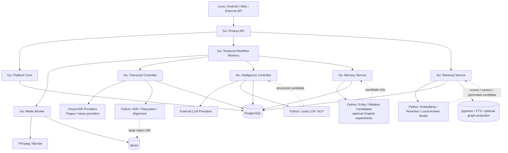
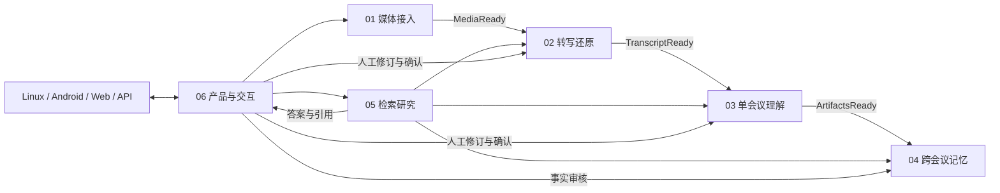
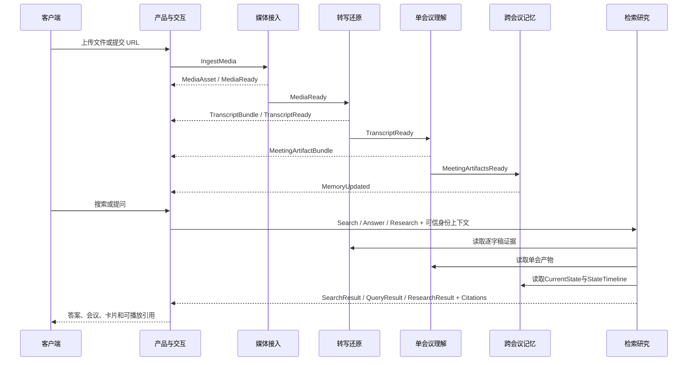

# NotaRitmo

NotaRitmo 是一个面向 Linux、Android、Web 和外部系统的会议 AI 架构研究项目。它不是一个
单体 Agent，也不是某个 ASR 或 LLM 的套壳，而是一套从媒体输入到可信会议知识服务的
可替换能力体系。

目标是把任意一场或多场会议转换为可验证、可检索、可演化、可交互的知识资产：

> 输入音频、视频或标准转写，输出逐字稿、说话人、摘要、章节、议题、事实、决策、
> 行动项、风险、开放问题、热词、词云、图谱、跨会议记忆、研究答案和可播放证据。

当前仓库只定义架构、合同、功能范围和验收标准，不包含业务代码、部署配置或既有系统实现。

## 六个业务模块

| 编号 | 模块 | 唯一职责 | 权威输出 |
|---|---|---|---|
| 01 | [媒体接入 Media Intake](01-media-intake/README.md) | 把外部输入变成安全、规范、可重复处理的媒体资产 | `MediaAsset` |
| 02 | [转写还原 Transcript Engine](02-transcript-engine/README.md) | 还原谁在什么时间说了什么 | `TranscriptBundle` |
| 03 | [单会议理解 Meeting Intelligence](03-meeting-intelligence/README.md) | 从一场会议中提取带证据的语义产物 | `MeetingArtifactBundle` |
| 04 | [跨会议记忆 Meeting Memory](04-meeting-memory/README.md) | 维护跨会议Observation、实体、状态槽、双时态和当前有效状态 | `MemorySnapshot`、`StateTimeline` |
| 05 | [检索研究 Retrieval / Research](05-retrieval-research/README.md) | 类型化搜索、证据问答、拒答、引用和异步跨会议研究 | `SearchResult`、`QueryResult`、`ResearchResult` |
| 06 | [产品与交互 Product Interaction](06-product-interaction/README.md) | 向客户端提供身份、任务、修订、搜索、问答和导出能力 | 稳定产品 API |

## 技术语言与运行时架构

### 已确定的技术原则

NotaRitmo 的主平台统一使用 Go，本地 AI 模型统一使用 Python：

> Go 拥有业务状态、权限、合同、任务、Provider 编排、验证和持久化；Python 只拥有模型加载、
> 批处理和推理过程，不拥有产品事实。

不为六个模块分别维护 Python 与 Rust 两套实现，也不要求一个模块只能使用一种语言。模块是
领域边界，语言按执行性质分工：

| 执行性质 | 权威实现 | 负责内容 |
|---|---|---|
| 在线产品与控制面 | Go | API、多租户、权限、任务、状态机、Provider 路由、缓存、成本、数据库事务 |
| 工作流与后台执行 | Go | Temporal Workflow、Activity、超时、重试、补偿、恢复、取消和阶段状态 |
| 本地模型推理面 | Python | ASR、Diarization、声纹、对齐、LLM、Embedding、Reranker 和模型实验 |
| 高性能模型服务 | Python / Triton | 模型常驻、动态批处理、并发实例、GPU 调度和推理指标 |
| 媒体原生工具 | FFmpeg / ffprobe | 探测、解码、转码、重采样、声道和基础滤镜 |
| 权威数据与对象存储 | PostgreSQL / MinIO | 事务事实、版本、权限、索引源、音频和大型中间产物 |
| 可重建检索与关系投影 | pgvector / FTS / 可选图存储 | 向量、全文索引和图候选，不拥有产品真相 |
| 经压测确认的 CPU/P99 热点 | 可选 Rust | 只重写有性能证据的窄组件，不复制整个业务模块 |

Rust、Java、Node.js 和 PHP 均不是主平台的第二套实现：

- Rust 只在 CPU Profile、内存测量和 P99 压测证明 Go 或 Python 某个窄路径成为瓶颈后引入。
- Java 不作为并行后端；现阶段不增加 JVM、第二套领域模型和第二套 Temporal Worker。
- Node.js / TypeScript 可以用于 Web 前端和构建工具，不拥有后端业务状态。
- PHP 不进入核心处理、工作流、Memory 或 Retrieval 链路。
- Android 客户端使用 Kotlin，但只消费 06 的稳定产品 API。

### 六模块语言分工

| 模块 | 权威控制层 | 模型或原生执行层 | 语言结论 |
|---|---|---|---|
| 01 媒体接入 | Go | FFmpeg / ffprobe；可选 Python 音频增强模型 | 基本纯 Go |
| 02 转写还原 | Go | Python ASR、Diarization、对齐、声纹模型；云 ASR 由 Go 调用 | Go + Python |
| 03 单会议理解 | Go | Python 本地 LLM/NLP；外部 LLM 由 Go 调用 | Go + Python |
| 04 跨会议记忆 | Go | 可选 Python 实体/关系候选与 Graphiti 实验 | Go 为绝对核心 |
| 05 检索研究 | Go | Python Embedding、Reranker、本地答案模型 | Go + Python |
| 06 产品与交互 | Go | Linux、Android、Web 客户端在平台外 | 纯 Go 后端 |

02 和 03 不是纯 Python。它们的模型算法可以由 Python 实现，但 Provider 选择、请求幂等、
输入输出版本、缓存、成本、证据校验、错误语义和权威结果必须由 Go 控制。04 更不能由某个
Python Memory 框架拥有：Python 只能产生候选，Go 和 PostgreSQL 决定什么成为当前有效事实。

### 运行拓扑



这张图表达的是权威方向，不代表第一天就部署十几个服务。研究期可以使用一个 Go 模块化
平台加若干 Python 模型进程；只有扩缩容、GPU 隔离、故障隔离或发布节奏出现真实需求时，
才拆成独立服务。

### Go 平台的权威职责

Go 平台统一负责：

- 创建并传播 `tenant_id`、`request_id`、`correlation_id`、`trace_id` 和幂等键。
- 执行身份验证、授权、租户隔离、配额、限流、审计和删除传播。
- 定义并验证跨模块 Schema、稳定 ID、版本、状态机、错误码和事件语义。
- 运行 Temporal Workflow 和 Activity，管理超时、重试、补偿、恢复、取消和部分成功。
- 根据能力、地域、隐私、质量、延迟和成本选择云端或本地 Provider。
- 记录输入哈希、Provider、模型、Prompt、算法、Token、成本、耗时和质量报告。
- 校验 Python 或外部 Provider 的结果，并转换为模块的权威输出。
- 管理 PostgreSQL 事务、Outbox、对象引用、索引重建和缓存失效。
- 向客户端提供稳定产品 API，不暴露内部模型、数据库或 Provider 原始结构。

### Python 模型面的职责

Python 模型进程只负责：

- 加载、预热、卸载和版本化本地模型。
- 对请求进行长度分桶、动态批处理、GPU/CPU 调度和资源限制。
- 执行 ASR、Diarization、声纹、Forced Alignment、LLM、Embedding 和 Reranker 推理。
- 返回文本、分数、向量、时间区间、候选关系、模型置信度和诊断指标。
- 支持离线评测、Shadow、A/B、模型替换和回放。

Python 模型进程禁止：

- 直接创建产品级 `meeting_id`、`claim_id`、权限或租户关系。
- 直接修改权威 PostgreSQL 业务表。
- 自行决定重试、当前有效State、用户可见范围或产品状态。
- 把模型候选未经 Go 校验直接发布为 Transcript、Artifact、Memory 或正式答案。
- 直接向 Android、Linux 或 Web 客户端提供产品接口。
- 把完整音频、逐字稿或敏感信息写入普通日志。

### 跨语言通信规则

| 数据类型 | 推荐通道 | 规则 |
|---|---|---|
| 小型同步结构 | gRPC / Protobuf | 明确 Deadline、错误码、Schema 版本和最大消息大小 |
| 产品 HTTP 接口 | REST / JSON 或流式 SSE | 只由 Go 的 06 模块对外提供 |
| 后台长任务 | Go Temporal Workflow / Activity | Go 拥有耐久状态；模型调用可提交、轮询、取消和恢复 |
| 大型音频、模型输入和归档 | MinIO URI | 不通过 JSON、事件或 Temporal History 搬运大对象 |
| 领域事件 | Outbox + 消息通道 | 只携带稳定 ID、版本和摘要，消费者必须幂等 |
| 权威状态 | PostgreSQL | 所有写入经过拥有该数据的 Go 模块 |
| 向量与图候选 | pgvector / 可选图投影 | 可删除、可重建，不能反向覆盖权威事实 |

所有跨语言对象都必须来自同一个版本化 Schema 源，并至少包含：

```text
tenant_id
resource_id
schema_version
source_hash
producer
producer_version
created_at
correlation_id
trace_id
```

Go 和 Python 都要运行同一组合同 Fixture：Go 验证领域约束，Python 验证模型输入输出，端到端
测试验证同一请求经过序列化、模型调用和反序列化后语义不漂移。

### 建议的进程与容器边界

初期建议保持少量部署单元：

```text
Go
├── notaritmo-api
├── notaritmo-workflow-worker
├── notaritmo-media-worker
└── platform-core packages
    ├── transcript
    ├── intelligence
    ├── memory
    └── retrieval

Python
├── model-asr
├── model-intelligence
└── model-retrieval

Infrastructure
├── PostgreSQL / pgvector
├── MinIO
├── Temporal
└── optional Triton / graph projection
```

- `platform-core packages` 是 Go 领域包，不要求初期分别部署。
- Python 按模型、GPU 占用和扩缩容特征拆进程，不按租户或用户启动模型。
- 多个租户共享模型副本池，但请求、缓存、日志、对象路径和结果始终带租户边界。
- 模型常驻并跨请求批处理；API QPS、音频分钟积压、GPU RTF、Token/s 和检索 P99 分别扩缩容。
- 将来拆服务时保持合同不变，Android 和其他客户端不需要知道内部拆分。

### Rust 引入门槛

只有同时满足以下条件，才允许把窄组件改写为 Rust：

1. 真实并发压测已经稳定复现问题。
2. CPU Profile 证明目标函数或路径占据主要 CPU，而不是等待数据库、Provider、GPU 或磁盘。
3. P99、吞吐或内存未达到明确 SLO。
4. Go/Python 的批处理、算法、缓存、查询和数据搬运优化已经完成。
5. Rust 版本拥有相同合同 Fixture、黄金结果和回归评测。
6. Rust 只替换窄 Provider 或库，不复制该模块的状态机、权限和持久化规则。

这六个模块是领域边界，不等于六个进程、六个容器或六个微服务。研究期可以是模块化单体，
部署期再根据算力、扩缩容、故障隔离和团队边界拆分服务。

## 正确的领域关系

产品与交互不是流水线的最后一步，而是用户入口和应用层；检索研究也不只读取 Memory。



允许的主依赖方向：

```text
01 -> 02 -> 03 -> 04
06 -> 01/02/03/04/05
05 -> 02/03/04 的只读接口
```

禁止的反向耦合：

- 上游模块不知道下游如何分析、存储或展示。
- 模块不能直接读取另一个模块的私有表、对象路径、队列或 Provider 原始 JSON。
- Product 不能直接调用特定 ASR、LLM、向量库或图数据库。
- Retrieval 不能修改Transcript、Artifact、Observation、Claim或StateVersion的权威状态。
- Memory 不负责回答自然语言问题，Retrieval 不负责决定什么事实当前有效。

## 五个横向平台面

横向能力贯穿六块，但不增加第七个业务模块。

| 平台面 | 负责 | 不负责 |
|---|---|---|
| 工作流与执行面 | DAG、队列、超时、重试、补偿、恢复、定时任务、背压 | 会议事实和产品判断 |
| 数据证据与存储面 | 对象存储、关系存储、事件、索引、血缘、删除传播 | 业务语义归属 |
| 安全与治理面 | 租户隔离、授权、加密、审计、保留期、合规、密钥 | 算法质量判断 |
| 模型与 Provider 面 | ASR、LLM、Embedding、Reranker、网关、限额、成本路由 | 稳定领域合同 |
| 评测与可观测面 | Trace、指标、日志、离线评测、回放、Shadow、质量门禁 | 修改权威结果 |

当前基线由 Go Temporal Workflow / Activity 实现耐久工作流；消息队列和普通状态机只能作为
局部传输、测试替身或对照实现，不能形成第二套权威任务状态。PostgreSQL、对象存储、pgvector、
Neo4j 属于数据证据与存储面；LiteLLM 或其他网关属于模型与 Provider 面。它们不是新的业务模块，
也不能越过拥有者模块控制产品事实。

## 数据权威与可重建投影

| 数据 | 权威模块 | 是否权威 | 可重建来源 |
|---|---|---:|---|
| 原始与规范化媒体 | 01 | 是 | 原始上传或外部来源 |
| 逐字稿、时间戳、匿名 Speaker | 02 | 是 | 媒体和 Provider 运行记录 |
| 摘要、章节、决策、待办等单会产物 | 03 | 是 | 指定版本 Transcript |
| Observation、实体、StateSlot、Claim和双时态StateVersion | 04 | 是 | Artifact、证据和人工确认 |
| 向量、倒排、图关系候选、缓存 | 04/05 的投影 | 否 | 权威数据 |
| 会话、任务、权限、反馈和导出记录 | 06 | 是 | 产品操作 |

原则：

1. PostgreSQL 等事务库保存权威结构化状态。
2. 向量库、全文索引和图数据库只保存可重建投影。
3. Provider 原始响应永久不能成为跨模块合同。
4. 任何派生结果必须记录输入版本和生产版本。
5. 删除必须从权威数据向媒体、索引、缓存、图投影和导出副本传播。

## 合同分层

不能用一条 `A -> B -> C` 同时表达写入和查询。合同分为四类。

### 1. 写入侧领域事件

```text
MediaReady
TranscriptReady
MeetingArtifactsReady
MemoryUpdated
ReindexRequested
CorrectionSubmitted
DeletionRequested
```

事件表达“已经发生的事实”，必须不可变、可幂等消费、可审计和可回放。事件只携带稳定
标识、版本和摘要，不携带大段媒体、完整逐字稿或 Provider 原始响应。

### 2. 模块命令

```text
IngestMedia
TranscribeMedia
AnalyzeMeeting
UpdateMemory
RebuildIndex
SubmitCorrection
DeleteMeeting
```

命令表达期望动作，必须携带 `request_id`、`tenant_id`、幂等键、目标资源和期望版本。
接收方可以接受、拒绝或返回冲突，不能把命令伪装成已经完成的事件。

### 3. 读取侧接口

```text
GetMedia
GetTranscript
GetArtifacts
GetCurrentState
GetStateTimeline
Search
Answer
StartResearch
GetResearchRun
GetCitationPlayback
GetJob
```

读取接口返回面向消费者的只读视图，例如 `TranscriptView`、`ArtifactView`、
`MemorySnapshot`、`StateTimeline`、`SearchResult`、`QueryResult`和`ResearchResult`。
读取视图不暴露内部表。

### 4. 公共基础合同

所有跨模块对象至少包含：

```text
tenant_id
resource_id
schema_version
source_hash
producer
producer_version
created_at
correlation_id
trace_id
```

公共合同包括：

- `EvidenceRef`：会议、片段、Speaker、起止时间、原文和媒体版本。
- `TenantScope`：租户、用户、项目、会议范围和授权快照。
- `VersionEnvelope`：输入、Schema、模型、Prompt、算法和产物版本。
- `ProviderRun`：Provider、请求哈希、状态、延迟、Token、成本和原始结果归档引用。
- `QualityReport`：质量分、风险标记、缺失能力和评测版本。
- `JobState`：阶段、进度、重试、取消和部分成功信息。
- `ErrorEnvelope`：稳定错误码、阶段、可重试性、用户提示和诊断引用。

公共证据引用示例：

```json
{
  "tenant_id": "tenant_x",
  "meeting_id": "meeting_x",
  "media_version": 1,
  "transcript_version": 3,
  "segment_id": "seg_018",
  "speaker_id": "speaker_02",
  "start_ms": 183200,
  "end_ms": 195800,
  "quote": "首版我们改成原生 Kotlin。",
  "quote_hash": "sha256:...",
  "citation_valid": true,
  "playback_ready": true
}
```

证据合法条件：资源存在、租户与权限匹配、时间位于媒体范围、原文与指定 Transcript
版本一致。`citation_valid`失败时不能把它作为正式答案证据；`playback_ready`只表示当前
是否能签发和访问短期音频地址，播放服务临时失败不得改变事实证据真假。

## 一场会议的完整生命周期



处理不要求“一次全成功”：

- 媒体可用但转写失败：保留媒体并允许重跑 02。
- 转写可用但理解失败：逐字稿仍可查看、搜索和修正。
- 单会产物可用但 Memory 更新失败：单会结果仍可用，跨会结果标记过期。
- 图或向量投影失败：权威数据仍然完整，可以重建索引。
- LLM 答案失败：退化为带排序证据的搜索结果，不能伪造答案。

## 离线与实时

实时不是第七模块，而是同一合同的增量模式：

```text
MediaChunk(partial)
  -> TranscriptDelta(partial)
  -> ArtifactDelta(optional)
  -> FinalizeTranscript(final)
  -> MeetingArtifactsReady(final)
  -> MemoryUpdated(final)
```

- `partial` 可撤回、可覆盖，不进入跨会议权威 Memory。
- `final` 必须有稳定片段 ID、时间轴和输入哈希。
- 实时摘要只用于会中辅助；会后必须基于最终 Transcript 重算。
- Memory 默认只接收最终产物，除非某类实时事实经过显式人工确认。

## 状态与错误语义

通用任务状态：

```text
CREATED -> QUEUED -> RUNNING -> SUCCEEDED
                         ├──> PARTIAL
                         ├──> FAILED
                         └──> CANCELLED
DELETION_PENDING -> DELETED
```

每个模块维护自己的阶段状态，产品层只聚合，不自行猜测。错误至少分为：

- `VALIDATION`：输入或 Schema 不合法，不重试。
- `AUTHORIZATION`：无权限，不重试并审计。
- `PROVIDER_CONFIGURATION`：密钥、地域、模型名错误，不自动重试。
- `TRANSIENT_PROVIDER`：限流、网络抖动、暂时不可用，可退避重试或切换 Provider。
- `QUALITY_GATE`：处理成功但质量不足，进入人工检查或降级。
- `CONFLICT`：版本冲突、重复确认或并发修订，需要重新读取。
- `INTERNAL`：程序缺陷或未知错误，停止自动扩散并保留诊断链路。

## Provider 插拔规则

Provider 只能存在于拥有该能力的模块内部：

| Provider 类型 | 归属模块 |
|---|---|
| 下载、对象存储、转码、质量分析、降噪 | 01 |
| 云或本地 ASR、对齐、说话人分离、声纹候选 | 02 |
| LLM、规则提取、单会校验、图表数据生成 | 03 |
| 实体消歧、关系候选、图投影、记忆实验实现 | 04 |
| FTS、Embedding、向量库、Reranker、回答模型 | 05 |
| 身份、通知、任务系统、导出、Webhook | 06 |

Tingwu、本地Qwen ASR或其他云ASR都是02的Provider；Qwen、OpenAI、Claude或本地模型可以
是03或05的Provider；Graphiti和Neo4j可在04产生图候选、在05提供只读图检索投影；
Mem0和Hindsight主要在05作为Agent Memory与端到端检索基线，任何结果都不能绕过04的
Observation、Claim、StateVersion与证据合同。pgvector或其他向量库只是05的检索投影。
替换这些实现不得改变客户端API和跨模块合同。

## 安全、隐私与多租户

- 每个资源、事件、缓存键、对象路径和索引行都必须带 `tenant_id`。
- 授权在 06 建立上下文，并在每个模块读写时再次执行，不只依赖 API 网关。
- 声纹属于敏感生物特征数据：独立授权、加密、用途限制、删除和审计。
- 外部 Provider 只获得完成当前动作所需的最小数据，记录地域和数据出境策略。
- 临时播放 URL 短期有效，签发前重新检查权限。
- 日志、Trace 和评测样本不得泄露完整音频、逐字稿、凭据或个人敏感信息。
- 删除操作要可追踪地传播到媒体、派生产物、Memory、索引、缓存、导出和备份策略。

## 六模块边界审计

六块的划分符合当前产品目标，但“合理”不等于六块彼此没有依赖，也不等于六块都使用同一种
测试方法。判断边界是否成立看四件事：

1. 是否只有一个明确的权威数据拥有者。
2. 是否存在独立的输入、输出和失败语义。
3. 是否能只替换该块实现而不修改其他模块内部代码。
4. 是否能使用固定 Fixture 和黄金标注独立评价该块。

审计结果：

| 模块 | 主要变化原因 | 独立性结论 | 必须防止的重新耦合 |
|---|---|---|---|
| 01 媒体接入 | 输入格式、安全、转码、质量和存储 | 高，可完全独立评测 | 为某个 ASR 私自改变媒体合同 |
| 02 转写还原 | ASR、时间、Diarization、Speaker Identity | 高，可直接用标准音频评测 | 把摘要、事实提取或产品身份主档塞进来 |
| 03 单会议理解 | Prompt、LLM、规则、证据校验和语义 Schema | 高，可用 Transcript Fixture 评测 | 读取其他会议或决定当前有效事实 |
| 04 跨会议记忆 | Promotion、实体归并、StateSlot、双时态和业务状态 | 高，可用多会议时序评测 | 把向量相似度或图候选直接当权威事实 |
| 05 检索研究 | 类型化召回、排序、拒答、覆盖、引用和异步研究 | 高，可用冻结知识快照评测 | 通过Answer或Research结果反写上游权威数据 |
| 06 产品与交互 | 权限、Job、修订、API、客户端和集成 | 中高，可做契约和场景评测 | 变成前五块算法和数据库的万能入口 |

02 和 06 内部功能较多，但仍然具有单一内聚目标：

- 02 的所有子能力共同回答“谁在什么时间说了什么”，应在模块内部拆成 Provider 和流水线，
  不需要升级成新的顶层业务模块。
- 04内部细分Observation、Entity、StateSlot、Claim、StateVersion和四类业务状态，但它们
  共同回答“系统应该记住什么、什么当前有效”，不需要拆成新的顶层模块。
- 05内部细分Online Search/Answer与Async Research，但二者都只读权威数据并回答“如何找到、
  覆盖、拒答和引用”，Research不是第七模块。
- 06 是应用层，内部可以继续分为 Identity、Job、Review、Conversation、Export 和
  Integration 子域，但客户端只面对一套稳定产品 API。
- 04 与 05 必须共同设计测试数据，但必须保持两个状态所有者：04 决定事实，05 只读取和回答。

因此，六块不是唯一可能的架构，也不存在脱离团队和产品约束的“理论最优微服务数量”；
但对当前“本地与云端 Provider 可替换、单会与跨会兼顾、Android 后接入”的目标，这六个
限界上下文已经足够完整，没有发现需要新增或合并顶层模块的证据。

### 每个模块的独立实验输入

“独立实验”表示可以使用标准合同和 Fixture 评价模块，不表示忽略真实上下游误差。

| 模块 | 批量输入 | 黄金标注 | 独立输出 | 核心指标 |
|---|---|---|---|---|
| 01 | 正常、损坏、超长、多声道、不同编码媒体及恶意 URL | 格式、时长、可解码性、质量标签和预期拒绝原因 | `MediaAsset`、质量报告、错误 | 接入率、错误拦截、质量相关性、RTF、资源 |
| 02 | 规范化音频、语言/人数提示和术语上下文 | 逐字稿、RTTM、重叠区间、词时标、人员标签子集 | `TranscriptBundle` | CER/WER、DER/JER、cpWER/tcpWER、时间误差 |
| 03 | 人工正确与真实 ASR 噪声两套 Transcript | 摘要、事实、决策、待办、风险和逐项证据 | `MeetingArtifactBundle` | 组件 F1、证据支持、幻觉、成本、延迟 |
| 04 | 多会议Artifact、证据、人工修订、乱序与删除事件 | Observation、实体、StateSlot、Claim、双时态和当前状态 | `MemorySnapshot`、`StateTimeline` | Promotion、实体/关系、时态、乱序收敛和当前状态 |
| 05 | 冻结的Transcript/Artifact/Memory快照、查询、权限和索引水位 | Meeting/Evidence qrels、Answer Claim、Policy和覆盖 | `SearchResult`、`QueryResult`、`ResearchResult` | Recall、排序、Meeting Set、回答、拒答、覆盖和引用 |
| 06 | API 命令、事件序列、权限矩阵、断网重试和客户端场景 | 预期响应、状态迁移、可见资源和审计结果 | 产品资源、Job、修订和导出 | 契约、权限、幂等、恢复、端到端完成率 |

03必须同时跑“人工正确Transcript”和“真实ASR Transcript”，才能区分理解模型错误与
上游识别错误。04使用具有真实业务时间线的多会议序列，并测试同一输入按不同到达顺序是否
收敛，不能把互不相关的Claim随机堆在一起。05必须包含有答案、无答案、无权限、旧决策替代、
全集覆盖和部分失败查询。06的“大量输入”是API、状态、权限和用户场景，而不是音频模型数据。

## 评测体系

每块独立评测，端到端再做用户任务评测。

| 模块 | 核心指标 |
|---|---|
| 01 | 接入成功率、质量检测相关性、转码速度、资源与存储成本 |
| 02 | CER/WER、DER/JER、SA-WER、词级时间误差、Speaker 身份准确率 |
| 03 | 摘要覆盖、事实/决策/行动项 F1、证据支持率、幻觉率、成本与延迟 |
| 04 | Promotion、实体/StateSlot归并、关系、双时态、乱序收敛和当前状态准确率 |
| 05 | Recall、MRR、nDCG、Meeting Set、Answer Claim、拒答、覆盖、引用和播放SLO |
| 06 | 上传到结果完成率、首个可用结果时间、修订成功率、权限泄漏数、任务恢复率 |

端到端必须覆盖：

- 四场以上相关会议的会议定位、单会总结、跨会总结和历史决策变化。
- 说话人错误、重叠语音、专业词、日期、金额和型号。
- 有答案、无答案、无权限、证据冲突和旧结论被新结论替代。
- 人工修正后 Transcript、Artifact、Memory 和索引的受控失效与重建。
- 每个答案引用原文并能播放正确音频时间点。
- 本地 Provider 与外部 API 在质量、延迟、算力、成本和隐私上的可比报告。

## 模块化控制变量研究方法

六个模块没有固定研究顺序。合同稳定后，每块都可以使用确定的数据独立实验、快速评估和
持续迭代；其他模块通过版本化 Fixture 提供输入，不要求真实 Provider 已经部署。

统一实验公式：

```text
固定数据集
  + 固定输入合同
  + 固定黄金标注
  + 每次只改变一个变量
  + 同一评测脚本
  = 可重复、可比较、可回归的模块结论
```

一次实验只允许改变一个主要变量，例如：

- 一个 Provider。
- 一个模型或模型版本。
- 一个 Prompt 或提取策略。
- 一个 VAD、Diarization、Embedding 或 Reranker 算法。
- 一个阈值、切片策略、融合策略或索引配置。
- 一个本地运行方案或外部 API 方案。

其余输入、数据集、预处理、下游 Fixture 和指标定义保持不变，避免把多项变化混在一起后
无法判断提升来自哪里。

每个模块都建立自己的实验资产：

| 实验资产 | 要求 |
|---|---|
| Dataset | 真实正常样本、边界样本、失败样本和对抗样本 |
| Ground Truth | 人工确认的文字、Speaker、事实、Claim、相关性或期望产品行为 |
| Baseline | 当前默认方案的质量、延迟、成本、算力和失败分布 |
| Candidate | 本次只改变一个主要变量的候选方案 |
| Run Manifest | 数据集、代码、Schema、Provider、模型、Prompt、参数和环境版本 |
| Metrics | 模块质量、延迟、吞吐、成本、CPU、内存、显存、存储和隐私边界 |
| Error Slices | 按语言、噪声、人数、时长、领域、问题类型和失败原因分桶 |
| Promotion Gate | 候选成为默认版本必须达到的质量、成本、稳定性和安全门槛 |

标准循环：

```text
选择模块和失败切片
  -> 冻结数据与基线
  -> 提出单一变量候选
  -> 离线回放
  -> 对比质量、资源、时间和成本
  -> 分析错误样本
  -> 通过门槛后升级模块默认版本
  -> 运行端到端回归
```

模块优化可以并行进行，但升级默认版本必须满足两层验收：

1. **模块验收**：在该模块黄金数据上优于或不劣于基线，并解释收益和退化切片。
2. **全链路验收**：确认局部优化没有破坏证据 ID、版本、权限、下游质量和用户任务结果。

实验结果必须保存原始指标和失败样本，不能只写“效果更好”。外部 API、本地模型、开源方案
和商业方案使用同一数据与指标评估，最终按场景选择默认 Provider，而不是预设唯一技术路线。

整体能力来自六块独立提升后的组合，同时受最弱证据链限制。因此目标不是追求某个单点模型
宣传指标，而是持续提高每块可量化能力，并用端到端回归保证组合后仍然可靠。

## 完成后的产品能力

- 上传 MP3、MP4、WAV、手机录音、URL 或公开媒体链接。
- 查看逐字稿、说话人、词级时间戳、置信度和低质量提示。
- 查看摘要、章节、议题、事实、决策、行动项、风险、开放问题和人员观点。
- 查看热词、词云数据、树状图、思维导图、时间线和会议质量分析。
- 搜索并定位指定会议、人物、项目、时间、数字、型号和原文。
- 对单场、多场、项目范围或全部有权会议提问。
- 查询某项决策为何变化、何时变化以及当前有效版本。
- 对多场会议做比较、整体总结、趋势、冲突和行动项连续跟踪。
- 每条正式结论回到指定 Transcript 版本和可播放原音频。
- 资料不足时明确拒答，权限不足时不泄露存在性。
- 人工修正文字、Speaker、摘要、决策、行动项和 Claim，并可追溯版本。
- 通过同一稳定 API 支持 Linux 研究客户端和后续 Android 产品。

## 目录

```text
NotaRitmo/
├── README.md
├── 01-media-intake/
│   └── README.md
├── 02-transcript-engine/
│   └── README.md
├── 03-meeting-intelligence/
│   └── README.md
├── 04-meeting-memory/
│   └── README.md
├── 05-retrieval-research/
│   └── README.md
└── 06-product-interaction/
    └── README.md
```

## 架构研究依据

- [DDD 中的限界上下文与微服务边界](https://learn.microsoft.com/en-us/dotnet/architecture/microservices/architect-microservice-container-applications/identify-microservice-domain-model-boundaries)
- [Recall.ai 转写架构](https://docs.recall.ai/docs/transcription)
- [AssemblyAI 说话人分离](https://www.assemblyai.com/docs/pre-recorded-audio/label-speakers)
- [AssemblyAI 音频理解能力](https://www.assemblyai.com/docs/speech-understanding/getting-started)
- [Microsoft Teams 会议回顾](https://support.microsoft.com/en-US/teams/meetings/recap-in-microsoft-teams)
- [Graphiti 时态知识图谱](https://github.com/getzep/graphiti)
- [LangGraph Agentic RAG](https://docs.langchain.com/oss/python/langgraph/agentic-rag)
- [pgvector](https://github.com/pgvector/pgvector)
- [Temporal](https://docs.temporal.io/)
- [Azure RAG 评测指标](https://learn.microsoft.com/en-in/azure/ai-foundry/concepts/evaluation-evaluators/rag-evaluators?view=foundry)
- [OpenSearch 重排序](https://docs.opensearch.org/latest/search-plugins/search-relevance/reranking-search-results)
