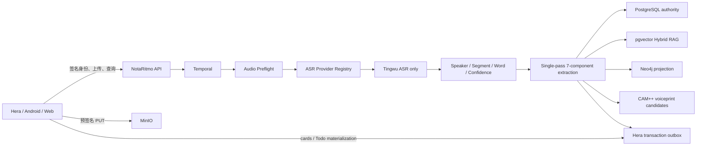

# NotaRitmo 架构

## 系统边界



Hera 不把 App 权限和 Todo 所有权交给 NotaRitmo。NotaRitmo 只负责音频到会议智能、
证据、记忆和检索，并通过 Outbox 交付证据卡片与 Todo 候选。

## 数据分层

1. Raw：原音频、输入 SHA-256、Provider Task、原始 ASR JSON。
2. Audio Derived：16 kHz mono WAV、预处理版本、VAD 与质量分。
3. Canonical：Meeting、Speaker、Segment、Word、时间、置信度。
4. Semantic：七类统一组件、13 类 Artifact、MemoryRecord、evidence。
5. Index/Delivery：pgvector、Neo4j、声纹候选、Hera Outbox。

Canonical 是文本证据权威。Artifact、Memory、向量、图和 Outbox 可按
`canonical_hash + model + prompt + schema` 重建。

## Temporal 工作流

```text
audio_preflight
  -> transcription
  -> canonical_normalization
  -> unified_extraction
  -> voiceprint_matching
  -> graph_projection
  -> hera_outbox
```

每阶段有独立超时、RetryPolicy、attempt、output 和 error。`pipeline_runs` /
`pipeline_stages` 是产品可查的流程审计；Temporal 保存执行历史。重处理先把会议改为
`QUEUED`，避免客户端把旧 READY 当成新流程完成。

## ASR 与统一提取

`ASRProvider` 只有 `submit / wait / normalize`。当前 Registry 只注册 Tingwu；多 ASR
没有实现。Tingwu 参数关闭章节、会议辅助、摘要、润色和翻译，只返回 ASR 能力。

统一 LLM 调用输入是一次紧凑 JSON：

```text
[ordinal, start_ms, end_ms, provider_speaker_id, text]
```

一次返回：

```text
summary, facts, decisions, action_items, risks, open_questions, topics
```

服务校验所有 evidence ordinal；无证据项被删除。章节、词云、思维导图、说话人统计等
只消费统一结果和 Canonical，不重复把全文发给不同 Prompt。

缓存键：

```text
SHA256(canonical_hash | provider | model | prompt_version |
       schema_version | prompt_hash)
```

每次执行仍写 `extraction_runs`；cache hit 的本次 Token/成本为 0，历史首次费用保留在
`extraction_cache` 和首次 Run。

## 声纹

声纹使用 sherpa-onnx 部署 3D-Speaker CAM++ 中文 16 kHz 模型，输出 192 维归一化向量。
注册时按 Tingwu Speaker 的 Segment 时间区间从规范化音频取样；跨会仅比较同 tenant、
同 model version 的 Profile。

匹配只产生 `PENDING` 候选，不自动把相似声音当真人。用户确认后才写
`Speaker.person_id`；拒绝、Profile 删除、Person 删除均可追踪并解绑。声纹不是身份认证，
阈值必须用真实业务录音评测后调整。

## 权限与 Hera

Hera 请求头：

```text
X-Hera-Tenant-ID
X-Hera-User-ID
X-Hera-Timestamp
X-Hera-Request-ID
X-Hera-Permissions
X-Hera-Signature
```

签名串是：

```text
METHOD\nPATH\nTENANT\nUSER\nTIMESTAMP\nREQUEST_ID\nPERMISSIONS
```

HMAC-SHA256 防篡改并校验时间偏差。请求上下文贯穿 PostgreSQL、MinIO 前缀、Temporal
payload、Voiceprint 和 Neo4j tenant 属性。开发模式可用默认租户；生产必须设置
`HERA_AUTH_REQUIRED=true`。

`meeting.intelligence.ready` Outbox 含：

- meeting 与 canonical hash；
- evidence-bound cards；
- todo_candidates；
- 明确的 ownership 字段。

Hera 拉取后 ACK；NotaRitmo 不创建 Hera Todo。

## Hybrid RAG 与记忆

LangGraph 查询路径保持：

```text
范围解析 -> Segment lexical/vector RRF -> Memory lexical/vector RRF
-> 跨会结构化分析 -> 确定性或 LLM 回答 -> 引用完整性验证
```

`MemoryRecord` 包含 fact、decision、action_item、risk、open_question、topic。
`MemoryLink` 记录 supersedes、follows_up、related_to。PostgreSQL 是权威源，Neo4j 和
可选 Graphiti 是可重建关系层。
