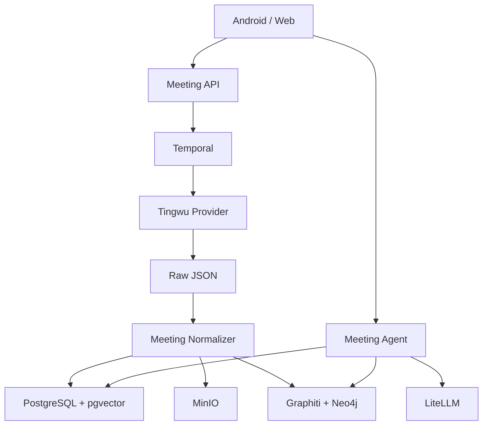

# 架构

## 目标

系统不是听悟客户端，而是独立的 Meeting Agent 平台。听悟只是第一个
`MeetingIntelligenceProvider`。



当前基线查询走 PostgreSQL 中文分词/文本匹配；向量列已预留，但只有配置并接入
Embedding 写入后才会成为混合召回。Graphiti 默认关闭，因此任何摘要、图谱或模型都
不能绕过 PostgreSQL 中的 Canonical Segment 直接充当证据。

## 数据分层

1. Raw：音频、供应商任务响应、所有供应商结果文件。
2. Canonical：Meeting、Speaker、Segment、词/句时间戳。
3. Derived：摘要、章节、任务、决定、风险、关键词、词云、思维导图。
4. Index：全文索引、向量和时态图谱。

Raw 不可变；Canonical 可以人工校正；Derived 和 Index 必须可以重建。

## 状态机

```text
CREATED
  -> SUBMITTED
  -> PROCESSING
  -> NORMALIZING
  -> READY

任意阶段 -> FAILED
人工修改 -> REPROCESSING -> READY
```

## 证据要求

Agent 的结论必须携带：

```text
meeting_id
segment_id
speaker_id / speaker_name
start_ms
end_ms
quote
```

图谱或摘要不能单独作为最终引用，必须回查 Canonical Segment。

## 多用户

每个核心对象保留 `tenant_id`。生产环境应在 PostgreSQL 启用 RLS，并在检索前解析
用户可访问的 meeting_id 集合。`User`、`Person` 和 `Speaker` 是三个不同实体。

## Graphiti

Graphiti 只接收确认后的 Memory Event，不直接成为事实数据库。第一阶段默认关闭；
启用 `graph` profile 和 `GRAPHITI_ENABLED=true` 后，由 Worker 把事件写入 Neo4j。
