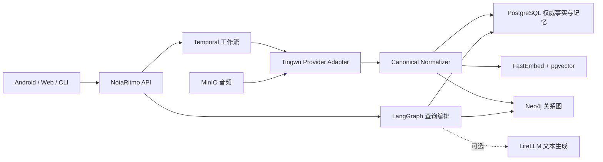

# NotaRitmo 架构

## 产品边界



App 不直接调用听悟。这样供应商凭证、异步任务、重试、原始结果差异和未来自建 ASR
都被限制在 Provider Adapter 内；App 面对的会议、记忆、查询和证据协议保持稳定。

## 四层数据

1. Raw：原始音频、供应商任务和原始 JSON。
2. Canonical：Meeting、Speaker、Segment、Word、开始/结束时间和置信度。
3. Derived：12 类产物与 MemoryRecord。
4. Index：HNSW 向量和 Neo4j 关系图。

Raw 不可变；Canonical 是证据权威；Derived 和 Index 可通过重新处理重建。

## 处理状态

```text
CREATED / UPLOADED / IMPORTED
  -> SUBMITTED
  -> PROCESSING
  -> NORMALIZING
  -> READY

graph_status: PENDING -> READY | DISABLED | FAILED
任意必要阶段失败 -> FAILED，由 Temporal 重试
```

会议只有在 Canonical、向量和默认图投影全部完成后，四会议验收才认为完全可用。

## 检索与回答

查询图由 LangGraph 编排：

```text
意图规划
  -> 当前权限/范围解析
  -> FastEmbed query vector
  -> Segment 文本召回 + pgvector 召回 + RRF
  -> Memory 文本召回 + pgvector 召回 + RRF
  -> 范围内会议结构化分析
  -> 确定性回答或可选 LLM 组织
  -> 引用完整性验证
```

范围支持当前会议、指定会议列表、项目、时间范围和全部会议。回答引用至少包含：

```text
meeting_id / meeting_title
segment_id
speaker_id / speaker_name
start_ms / end_ms
quote
retrieval score
```

## 会议记忆

`MemoryRecord` 保存 decision、action_item、risk、open_question、topic。每条必须有
Canonical Segment 证据；没有原文命中的供应商关键词只能作为 Artifact，不能晋升为
长期事实。

`MemoryLink` 保存 `supersedes`、`follows_up`、`related_to`，同时把旧决策标记为
`superseded` 并保留有效期。Neo4j 默认投影 Project、Meeting、Speaker、Segment、
Memory、Topic 以及证据和演进边。

Graphiti 已作为可选增强器接入。只有配置支持结构化输出的 LLM 后才应开启
`GRAPHITI_ENABLED=true`；无论是否开启，确定性 Neo4j 图和 PostgreSQL 记忆都工作。

## 多用户边界

核心事实带 `tenant_id`，并存在 User、MeetingAccess 与默认用户隔离查询。当前运行模式
仍是单默认租户，尚未实现登录令牌和 PostgreSQL RLS。多用户阶段需要：

1. OIDC/OAuth 身份映射到 User/Tenant。
2. 每次请求解析可访问 meeting ID。
3. PostgreSQL RLS 和对象存储前缀隔离。
4. 对话、查询审计和图查询使用同一权限过滤集合。

Neo4j 不能独立决定访问权限；必须由 PostgreSQL 权限结果约束图查询。
